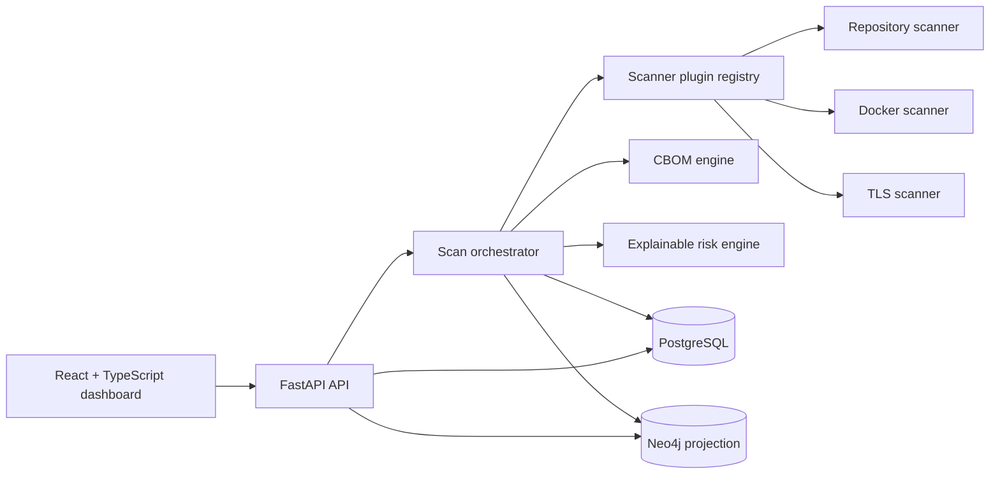
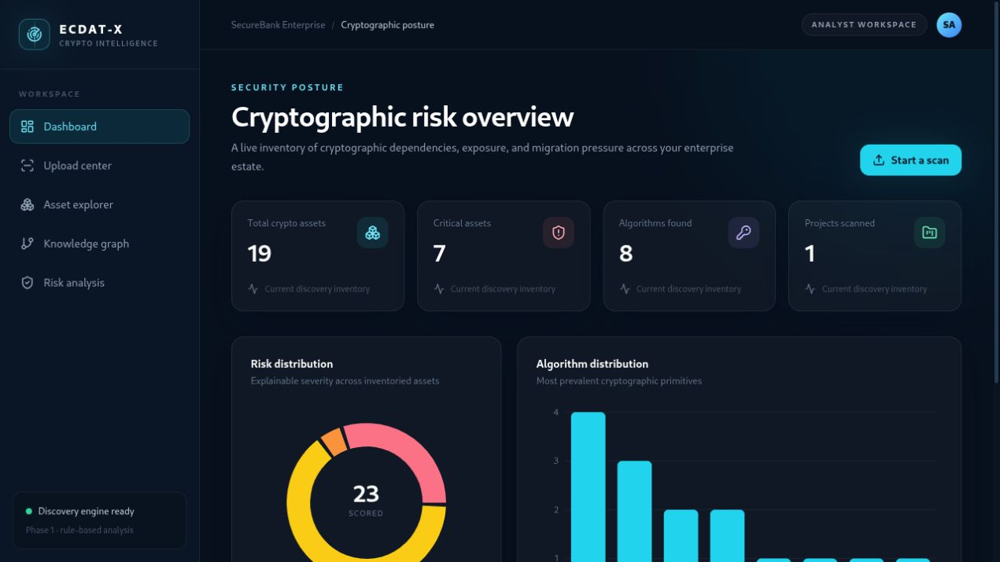

# ECDAT-X

**Enterprise Cryptographic Discovery, Analysis & Transformation Platform**

ECDAT-X gives security teams an evidence-backed map of where cryptography exists, what depends on it, and why it matters. Phase 1.5 accepts repository ZIPs, Docker image references, and TLS endpoints; normalizes discoveries into an inventory and CBOM; projects relationships into Neo4j; and calculates explainable rule-based risk.

Phase 2 adds a cryptographic intelligence layer that answers how dangerous a finding is, which
systems are affected, what must migrate first, and which post-quantum alternative fits the
environment. It preserves every Phase 1.5 scanner and persistence contract.

Phase 3 turns the platform into an organization-isolated enterprise service with JWT
authentication, role-based access, audit trails, exportable reports, production deployment assets,
security CI, and a public scanner extension contract. Discovery and intelligence remain intact.

> ECDAT-X is a security administration system. Use the production profile, TLS termination,
> external secrets, and restricted scanner workers before exposing it beyond a trusted network.

## Phase 3 enterprise platform

- JWT access tokens, rotating refresh tokens, and salted scrypt password hashing
- Administrator, security analyst, auditor, and viewer permissions
- Organization isolation for projects, scans, assets, risks, and migration plans
- Audit history and cryptographic inventory, quantum-risk, migration, PDF, JSON, and CBOM exports
- Admin, security-operations, and auditor dashboard experiences
- Stable scanner plugin interface and Python entry-point discovery
- Full component health, API/proxy rate limits, hardened headers, and exact-origin CORS
- Alembic migrations, production Compose, internal data networks, and Nginx reverse proxy
- Test, build, dependency, secret, and Trivy GitHub Actions
- Apache-2.0 licensing and contributor/security/community governance

## Phase 1.5 capabilities

- Plugin-based repository, Docker, and TLS discovery
- Python, Java, JavaScript/TypeScript, and C/C++ crypto-pattern detection
- Dependency-manifest and configuration evidence
- Secure ZIP extraction with traversal, symlink, file-count, and expanded-size limits
- Container package/OpenSSL inspection with an isolated runtime probe
- TLS protocol, cipher, certificate, and public-key collection with SSRF controls
- PostgreSQL cryptographic inventory and scan history
- CycloneDX-inspired ECDAT-CBOM JSON
- Neo4j topology with a PostgreSQL graph fallback
- Deterministic algorithm + dependency + criticality risk scoring
- React dashboard, upload center, asset explorer, React Flow graph, and risk analysis
- SecureBank Enterprise demo estate for immediate evaluation

## Phase 2 cryptographic intelligence

- Multi-channel evidence correlation across source, Docker, TLS, certificates, and libraries
- Configurable quantum-vulnerability knowledge in `risk_engine/algorithm_risks.json`
- Harvest Now, Decrypt Later analysis using sensitivity, lifetime, exposure, and algorithm risk
- Neo4j-backed dependency degree, blast radius, and critical-path impact with PostgreSQL fallback
- Assignable business ownership, criticality, retention, downtime, and compatibility context
- Migration complexity scoring for dependencies, legacy technology, downtime, and compatibility
- Normalized 0–100 final risk with a complete six-factor explanation
- Constraint-aware ML-KEM and ML-DSA recommendations with hybrid transition strategies
- Dependency-aware roadmap waves that migrate primitives, shared libraries, then applications
- Quantum Risk, Asset Intelligence, Blast Radius, Migration Planner, and PQC dashboard pages

The SecureBank Phase 2 scenario demonstrates a shared RSA-2048 certificate protecting 43 systems,
20-year customer-data retention, a final risk score of 94, and a three-wave PQC migration plan.

## ECDAT-X intelligence architecture


### Risk scoring methodology

The ECDAT score is a weighted, normalized sum: quantum vulnerability 30%, HNDL exposure 20%,
dependency centrality 15%, business criticality 15%, migration complexity 10%, and evidence
confidence 10%. Scores of 0–30 are Low, 31–60 Medium, 61–80 High, and 81–100 Critical. Every
response includes the component contributions and plain-language reasons.

### Migration workflow

1. Confirm a finding through independent evidence channels.
2. Classify quantum vulnerability and HNDL exposure.
3. Calculate the affected application blast radius.
4. Apply business and operational migration constraints.
5. Select ML-KEM, ML-DSA, or a hybrid TLS strategy.
6. Sequence trust anchors and primitives before shared libraries and applications.

See [Phase 2 architecture](docs/phase2-architecture.md) for the model, persistence, API, and
roadmap contracts.

## How repository discovery works

The upload flow securely extracts a ZIP into an isolated job directory, enforces archive and file
limits, and dispatches the source scanner through the common plugin registry. The scanner examines
supported source files line by line, records the exact file, line, evidence, confidence, and
language, then correlates dependency manifests and Dockerfile declarations. The orchestrator
normalizes findings into PostgreSQL, scores every asset, generates the ECDAT-CBOM, and updates the
Neo4j projection. If Neo4j is offline, graph responses automatically fall back to PostgreSQL.

| Category | Detected examples |
|---|---|
| Symmetric crypto | AES-128/192/256, DES, 3DES |
| Public-key crypto | RSA, ECC/ECDSA/ECDH, Diffie-Hellman |
| Hashing and MAC | SHA-1, SHA-256/384/512, SHA-3, HMAC |
| Libraries | OpenSSL, PyOpenSSL, Bouncy Castle, Crypto++, libsodium, PyCryptodome, Python cryptography, Node.js crypto |
| Configuration | TLS 1.2/1.3 and configured certificates |
| Containers | Base image plus declared OpenSSL and cryptographic packages |

### Try the SecureBank repository

```bash
cd sample_enterprise
zip -r secure-bank.zip secure-bank
```

Open <http://localhost:5173/upload>, choose `secure-bank.zip`, and start the repository scan. The
progress card moves through Scanning, Analyzing, Generating CBOM, and Completed. The result contains
evidence similar to:

```json
{
  "type": "algorithm",
  "name": "RSA-2048",
  "location": "secure-bank/authentication-service/auth.py:9",
  "evidence": "RSA.generate(2048)",
  "confidence": 0.96,
  "details": {"language": "python"}
}
```

## Architecture



PostgreSQL is authoritative for projects, scans, assets, relationships, and risk findings. Neo4j is a rebuildable projection; if Neo4j is unavailable, the graph API continues from PostgreSQL.

See [Architecture](docs/architecture.md), [Development](docs/development.md), and
[Enterprise API reference](docs/api-reference.md) for implementation details.

## Requirements

- Docker Engine
- Docker Compose (`docker-compose` or the `docker compose` plugin)
- At least 4 GiB of available memory
- Node.js 22+ and Python 3.11+ only when running services outside Docker

## Installation

```bash
git clone https://github.com/ROHIT-JR/enterprise-cryptographic-risk-platform.git
cd enterprise-cryptographic-risk-platform
docker-compose up
```

No cloud account or external database is required. Compose builds the development images, installs dependencies, waits for PostgreSQL and Neo4j, starts FastAPI, and serves Vite on port 5173. The SecureBank demo is seeded on first startup.

Local demo users share the `ECDAT_DEMO_PASSWORD` value from `.env`: `securebank-admin`,
`security-analyst`, and `security-auditor`, in organization `SecureBank`. Replace or disable these
accounts outside the local demo.

## Local access

- Frontend: <http://localhost:5173>
- Backend: <http://localhost:8000>
- API documentation: <http://localhost:8000/docs>
- Combined connection health: <http://localhost:8000/health>
- PostgreSQL: `localhost:5432`
- Neo4j Browser: <http://localhost:7474>
- Neo4j Bolt: `localhost:7687`

Stop services without deleting persisted database data:

```bash
docker-compose down
```

The built-in credentials are for local development only. Copy `.env.example` to `.env` and replace them before using the stack on a shared machine. Set `ECDAT_SEED_DEMO=false` for an empty inventory.

Docker discovery needs access to the host Docker socket. Determine its group ID with `stat -c '%g' /var/run/docker.sock` and set `DOCKER_GID` in `.env` if it differs from `999`. Treat socket access as privileged and isolate the backend host accordingly.

## Running services outside Docker

Backend:

```bash
python -m venv .venv
source .venv/bin/activate
python -m pip install -r backend/requirements-dev.txt
DATABASE_URL=sqlite+pysqlite:///./ecdat.db ECDAT_NEO4J_ENABLED=false python -m backend.app.seed
DATABASE_URL=sqlite+pysqlite:///./ecdat.db ECDAT_NEO4J_ENABLED=false uvicorn backend.app.main:app --reload
```

Frontend (Node.js 22+):

```bash
cd frontend
npm ci
npm run dev
```

`frontend/.env` sets `VITE_API_URL=http://localhost:8000`. Vite is available at <http://localhost:5173>.

## Test and quality gates

```bash
pytest
ruff check backend scanners cbom_engine knowledge_graph risk_engine migration_engine tests
cd frontend && npm run typecheck && npm run test -- --run && npm run build
```

The repository includes GitHub Actions for the same backend and frontend checks plus Dependabot coverage for Python, npm, and Docker dependencies.

## API surface

| Workflow | Endpoint |
|---|---|
| PostgreSQL + Neo4j health | `GET /health` |
| Full platform health | `GET /health/full` |
| Login / refresh | `POST /api/v1/auth/login`, `POST /api/v1/auth/refresh` |
| Dashboard summary | `GET /api/v1/dashboard` |
| Repository discovery | `POST /api/v1/scans/repository` |
| Docker discovery | `POST /api/v1/scans/docker` |
| TLS discovery | `POST /api/v1/scans/tls` |
| Scan status | `GET /api/v1/scans/{scan_id}` |
| CBOM document | `GET /api/v1/scans/{scan_id}/cbom` |
| Asset inventory | `GET /api/v1/assets` |
| Risk findings | `GET /api/v1/risks` |
| Knowledge graph | `GET /api/v1/graph` |

Phase 1.5 compatibility aliases are also available at `POST /api/upload/repository`,
`GET /api/assets`, `GET /api/cbom/{project_id}`, `GET /api/risk`, and `GET /api/graph`.

| Phase 2 workflow | Endpoint |
|---|---|
| Final quantum risk | `GET /api/v1/intelligence/risk` |
| HNDL exposure | `GET /api/v1/intelligence/hndl` |
| Blast radius | `GET /api/v1/intelligence/blast-radius` |
| Business context | `PUT /api/v1/intelligence/business-context/{asset_id}` |
| PQC recommendations | `GET /api/v1/migration/recommendations` |
| Migration roadmap | `GET /api/v1/migration/roadmap` |

Interactive OpenAPI documentation is exposed at `/docs`. Enterprise examples and response
contracts are in [docs/api-reference.md](docs/api-reference.md); discovery-specific contracts are
in [docs/api.md](docs/api.md).

## Repository layout

```text
backend/          FastAPI application, persistence models, APIs, orchestration
frontend/         React/Vite/Tailwind analyst dashboard
scanners/         Scanner plugin contracts and built-in discovery plugins
cbom_engine/      ECDAT-CBOM generator
knowledge_graph/  Neo4j projection and graph contracts
risk_engine/      Phase 1 compatibility rules and Phase 2 intelligence engines
migration_engine/ PQC selection and dependency-aware roadmap generation
sample_data/      Seed data used by the built-in dashboard demo
sample_enterprise/ Uploadable mixed-language SecureBank discovery fixture
tests/            Backend, scanner, CBOM, risk, and API-contract tests
docs/             Architecture, API, development, and security guidance
```

## Screenshots



The dashboard is responsive and includes dedicated views for upload progress, inventory evidence, dependency topology, and risk factor composition.

## Deployment notes

- **Local first:** `docker-compose.yml` is the primary Phase 1 deployment and runs all four services on the developer machine.
- **Future hosting:** the Dockerfiles retain separate development and production stages; override `VITE_API_URL`, database URLs, and credentials in the target environment.
- **Secrets:** `.env` files are ignored. Only non-secret templates and local development defaults are committed.
- **Private TLS targets:** disabled by default. Enable only for a controlled internal deployment.
- **Enterprise deployment:** use `deployment/docker-compose.prod.yml`; see [deployment](docs/deployment.md).
- **Authentication:** all application APIs require JWT authentication; health and authentication
  bootstrap endpoints remain public.

## Extension points

The plugin contract supports future AWS, Azure, Kubernetes, and HSM scanners. Production images are
cloud-portable without forcing a provider. A shared job queue and distributed rate limiter are the
next scale upgrades; automated migration execution and an AI assistant remain outside this release.
