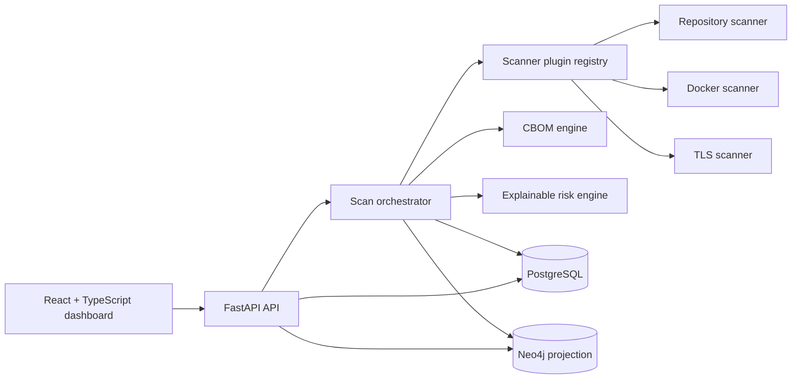

# ECDAT-X

**Enterprise Cryptographic Discovery, Analysis & Transformation Platform**

ECDAT-X gives security teams an evidence-backed map of where cryptography exists, what depends on it, and why it matters. Phase 1 accepts repository ZIPs, Docker image references, and TLS endpoints; normalizes discoveries into an inventory and CBOM; projects relationships into Neo4j; and calculates explainable rule-based risk.

> Phase 1 deliberately excludes authentication, multi-tenancy, machine-learning prediction, migration optimization, and an AI chatbot. Deploy it only on a trusted administrative network.

## Phase 1 capabilities

- Plugin-based repository, Docker, and TLS discovery
- Python, Java, JavaScript/TypeScript, and C/C++ crypto-pattern detection
- Dependency-manifest and configuration evidence
- Secure ZIP extraction with traversal, symlink, file-count, and expanded-size limits
- Container package/OpenSSL inspection with an isolated runtime probe
- TLS protocol, cipher, certificate, and public-key collection with SSRF controls
- PostgreSQL cryptographic inventory and scan history
- CycloneDX-inspired ECDAT-CBOM JSON
- Neo4j topology with a PostgreSQL graph fallback
- Deterministic algorithm + dependency + criticality risk scoring
- React dashboard, upload center, asset explorer, React Flow graph, and risk analysis
- SecureBank Enterprise demo estate for immediate evaluation

## Architecture



PostgreSQL is authoritative for projects, scans, assets, relationships, and risk findings. Neo4j is a rebuildable projection; if Neo4j is unavailable, the graph API continues from PostgreSQL.

See [Architecture](docs/architecture.md), [Development](docs/development.md), and [API reference](docs/api.md) for implementation details.

## Requirements

- Docker Engine
- Docker Compose (`docker-compose` or the `docker compose` plugin)
- At least 4 GiB of available memory
- Node.js 22+ and Python 3.11+ only when running services outside Docker

## Installation

```bash
git clone https://github.com/ROHIT-JR/enterprise-cryptographic-risk-platform.git
cd enterprise-cryptographic-risk-platform
docker-compose up
```

No cloud account or external database is required. Compose builds the development images, installs dependencies, waits for PostgreSQL and Neo4j, starts FastAPI, and serves Vite on port 5173. The SecureBank demo is seeded on first startup.

## Local access

- Frontend: <http://localhost:5173>
- Backend: <http://localhost:8000>
- API documentation: <http://localhost:8000/docs>
- Combined connection health: <http://localhost:8000/health>
- PostgreSQL: `localhost:5432`
- Neo4j Browser: <http://localhost:7474>
- Neo4j Bolt: `localhost:7687`

Stop services without deleting persisted database data:

```bash
docker-compose down
```

The built-in credentials are for local development only. Copy `.env.example` to `.env` and replace them before using the stack on a shared machine. Set `ECDAT_SEED_DEMO=false` for an empty inventory.

Docker discovery needs access to the host Docker socket. Determine its group ID with `stat -c '%g' /var/run/docker.sock` and set `DOCKER_GID` in `.env` if it differs from `999`. Treat socket access as privileged and isolate the backend host accordingly.

## Running services outside Docker

Backend:

```bash
python -m venv .venv
source .venv/bin/activate
python -m pip install -r backend/requirements-dev.txt
DATABASE_URL=sqlite+pysqlite:///./ecdat.db ECDAT_NEO4J_ENABLED=false python -m backend.app.seed
DATABASE_URL=sqlite+pysqlite:///./ecdat.db ECDAT_NEO4J_ENABLED=false uvicorn backend.app.main:app --reload
```

Frontend (Node.js 22+):

```bash
cd frontend
npm ci
npm run dev
```

`frontend/.env` sets `VITE_API_URL=http://localhost:8000`. Vite is available at <http://localhost:5173>.

## Test and quality gates

```bash
pytest
ruff check backend scanners cbom_engine knowledge_graph risk_engine tests
cd frontend && npm run typecheck && npm run test -- --run && npm run build
```

The repository includes GitHub Actions for the same backend and frontend checks plus Dependabot coverage for Python, npm, and Docker dependencies.

## API surface

| Workflow | Endpoint |
|---|---|
| PostgreSQL + Neo4j health | `GET /health` |
| Dashboard summary | `GET /api/v1/dashboard` |
| Repository discovery | `POST /api/v1/scans/repository` |
| Docker discovery | `POST /api/v1/scans/docker` |
| TLS discovery | `POST /api/v1/scans/tls` |
| Scan status | `GET /api/v1/scans/{scan_id}` |
| CBOM document | `GET /api/v1/scans/{scan_id}/cbom` |
| Asset inventory | `GET /api/v1/assets` |
| Risk findings | `GET /api/v1/risks` |
| Knowledge graph | `GET /api/v1/graph` |

Interactive OpenAPI documentation is exposed at `/docs`. Examples and response contracts are in [docs/api.md](docs/api.md).

## Repository layout

```text
backend/          FastAPI application, persistence models, APIs, orchestration
frontend/         React/Vite/Tailwind analyst dashboard
scanners/         Scanner plugin contracts and built-in discovery plugins
cbom_engine/      ECDAT-CBOM generator
knowledge_graph/  Neo4j projection and graph contracts
risk_engine/      Explainable Phase 1 risk rules
sample_data/      SecureBank demo and vulnerable repository fixture
tests/            Backend, scanner, CBOM, risk, and API-contract tests
docs/             Architecture, API, development, and security guidance
```

## Screenshots


The dashboard is responsive and includes dedicated views for upload progress, inventory evidence, dependency topology, and risk factor composition.

## Deployment notes

- **Local first:** `docker-compose.yml` is the primary Phase 1 deployment and runs all four services on the developer machine.
- **Future hosting:** the Dockerfiles retain separate development and production stages; override `VITE_API_URL`, database URLs, and credentials in the target environment.
- **Secrets:** `.env` files are ignored. Only non-secret templates and local development defaults are committed.
- **Private TLS targets:** disabled by default. Enable only for a controlled internal deployment.
- **Authentication:** intentionally out of Phase 1. Put the application behind an authenticated reverse proxy before any shared deployment.

## Phase 2-ready extension points

The domain boundaries allow future quantum risk profiles, harvest-now-decrypt-later analysis, graph centrality, PQC recommendations, and migration optimization without replacing scanner or persistence contracts. See the decision boundaries in [docs/architecture.md](docs/architecture.md).
