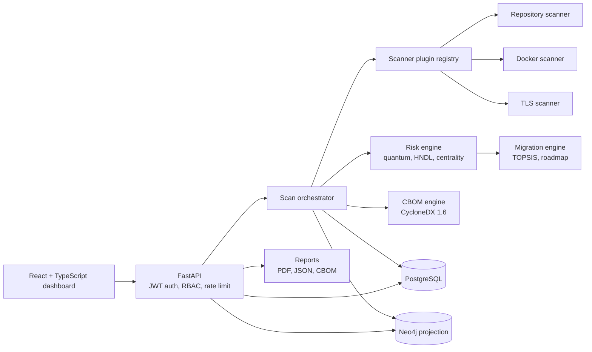
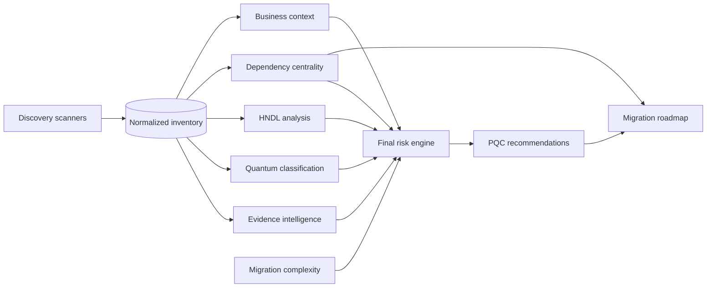

# ECDAT-X

**Enterprise Cryptographic Discovery, Analysis & Transformation Platform**

[](https://github.com/ROHIT-JR/enterprise-cryptographic-risk-platform/actions/workflows/ci.yml)
[](https://github.com/ROHIT-JR/enterprise-cryptographic-risk-platform/actions/workflows/security.yml)
[](LICENSE)
[](backend/requirements.txt)
[](frontend/package.json)
[](docker-compose.yml)

Find every cryptographic algorithm in an enterprise's codebase, containers, and TLS endpoints — know exactly which ones a quantum computer breaks, which systems that takes down with them, and in what order to migrate them.

**🔗 Live demo: [ecdat-x.pages.dev](https://ecdat-x.pages.dev)** — access is free. Email **ecdatxadmin01@gmail.com** to have an organization and user account created for you.

---

## Overview

Enterprises don't know where cryptography lives in their own systems, which makes planning a post-quantum migration close to impossible. ECDAT-X scans source code, container images, and live TLS endpoints; builds an evidence-backed inventory of every cryptographic primitive it finds; scores each one for quantum risk; and produces a dependency-aware migration roadmap to post-quantum algorithms — with the audit trail, access control, and reporting an enterprise security team actually needs to act on it.

## What it does

- 🔍 **Discover** — scan repositories, Docker images, and live TLS endpoints for RSA, ECC, AES, hashing, and cryptographic library usage, with exact file/line evidence for every finding
- ⚛️ **Quantify quantum risk** — a six-factor explainable score (quantum vulnerability, harvest-now-decrypt-later exposure, blast radius, business criticality, migration complexity, evidence confidence) plus the Mosca inequality (X + Y > Z) answering "do we need to start migrating *now*?"
- 🗺️ **Plan the migration** — TOPSIS-ranked ML-KEM/ML-DSA recommendations and a dependency-aware, wave-sequenced roadmap that migrates trust anchors before the applications that depend on them
- 📄 **Prove compliance** — CycloneDX 1.6 CBOM export, branded executive/technical PDF reports, and a live India National Quantum Mission (NQM) phase-readiness dashboard
- 🏢 **Govern access at scale** — organization-isolated tenants, four-tier RBAC, a platform-admin console that can provision organizations and audit them cross-tenant, and a full audit trail on every sensitive action

## Architecture



PostgreSQL is authoritative for organizations, projects, scans, assets, relationships, risk findings, and the audit trail. Neo4j is a rebuildable projection of the asset dependency graph; if Neo4j is unavailable, graph queries automatically fall back to PostgreSQL, so the platform degrades gracefully rather than failing.



The full system architecture, the upload-to-report data flow, the risk-scoring methodology, the TOPSIS decision, and the database schema are drawn in [docs/architecture.md](docs/architecture.md). The intelligence engine's internals (evidence fusion, HNDL model, dependency centrality, business-context weighting) are documented in [docs/phase2-architecture.md](docs/phase2-architecture.md).

### Risk scoring methodology

Every finding gets a weighted, normalized 0–100 score: quantum vulnerability 30%, harvest-now-decrypt-later exposure 20%, dependency centrality 15%, business criticality 15%, migration complexity 10%, and evidence confidence 10%. Scores of 0–30 are Low, 31–60 Medium, 61–80 High, and 81–100 Critical. Every API response includes the component contributions and plain-language reasons — nothing is a black box.

### Migration workflow

1. Confirm a finding through independent evidence channels.
2. Classify quantum vulnerability and HNDL exposure.
3. Calculate the affected application's blast radius.
4. Apply business and operational migration constraints.
5. Select ML-KEM, ML-DSA, or a hybrid TLS strategy via TOPSIS multi-criteria ranking.
6. Sequence trust anchors and shared primitives before the applications that depend on them.

## How discovery works

The upload flow securely extracts a repository archive (or fetches one directly from a public GitHub URL) into an isolated job directory, enforces archive and file limits, and dispatches the source scanner through the plugin registry. The scanner parses supported source files — including constructs split across multiple lines or hidden behind an import alias — and records the exact file, line, evidence, confidence, and language for every match, then correlates dependency manifests and Dockerfile declarations. The orchestrator normalizes findings into PostgreSQL, scores every asset, generates the CycloneDX CBOM, and updates the Neo4j projection.

| Category | Detected examples |
|---|---|
| Symmetric crypto | AES-128/192/256, DES, 3DES, RC4 |
| Public-key crypto | RSA, ECC/ECDSA/ECDH, Diffie-Hellman |
| Hashing and MAC | MD5, SHA-1, SHA-256/384/512, SHA-3, HMAC |
| Libraries | OpenSSL, Bouncy Castle, Crypto++, libsodium, PyCryptodome, Python `cryptography`, Node.js `crypto` |
| Configuration | TLS 1.2/1.3, configured certificates, hardcoded key material |
| Containers | Base image plus declared OpenSSL and cryptographic packages |

Source scanning covers Python, Java, JavaScript/TypeScript, and C/C++. Ongoing research toward broader language coverage and a sourced, cross-checked algorithm catalog lives in [docs/research](docs/research).

<details>
<summary>Try it against the bundled sample fixture</summary>

```bash
cd sample_enterprise
zip -r secure-bank.zip secure-bank
```

Open <http://localhost:5173/upload>, choose `secure-bank.zip`, and start a repository scan. The result includes evidence like:

```json
{
  "type": "algorithm",
  "name": "RSA-2048",
  "location": "secure-bank/authentication-service/auth.py:9",
  "evidence": "RSA.generate(2048)",
  "confidence": 0.96,
  "details": {"language": "python"}
}
```

</details>

## Enterprise access control

- JWT access tokens, rotating refresh tokens, and salted scrypt password hashing
- Four roles per organization — **administrator**, **security analyst**, **auditor**, **viewer** — each with a genuinely different UI and API surface, not just a hidden nav item
- Organization isolation for projects, scans, assets, risks, migration plans, and the audit trail
- A separate **platform-admin** capability (not a role — a dedicated flag) that can provision new organizations, audit any organization's activity, and view another organization's dashboard read-only — every cross-organization access is itself written to that organization's own audit trail
- A hidden, out-of-band platform-admin login, never exposed through public self-registration
- Branded PDF/JSON exports: executive summary, technical report, inventory, quantum-risk, migration, and CycloneDX 1.6 CBOM

## Tech stack

| Layer | Technology |
|---|---|
| Frontend | React 19, TypeScript, Vite, Tailwind |
| Backend | FastAPI, SQLAlchemy 2.0, Pydantic v2, Alembic |
| Primary datastore | PostgreSQL |
| Graph datastore | Neo4j (optional, with a PostgreSQL fallback) |
| Auth | JWT (access + rotating refresh tokens), scrypt password hashing |
| CBOM | CycloneDX 1.6 |
| CI | GitHub Actions — tests, lint, security scanning (Trivy, gitleaks), Dependabot |
| Deployment | Docker Compose (local), Render + Cloudflare Pages + Neon + Neo4j AuraDB (production, all free-tier) |

## Repository layout

```text
backend/           FastAPI application, persistence models, APIs, orchestration
frontend/          React/Vite/Tailwind analyst dashboard
scanners/          Scanner plugin contracts and built-in discovery plugins
cbom_engine/       CycloneDX CBOM generator
knowledge_graph/   Neo4j projection and graph contracts
risk_engine/       Risk scoring and cryptographic intelligence engines
migration_engine/  PQC selection and dependency-aware roadmap generation
lifecycle_engine/  Asset lifecycle state machine and governance status
benchmarks/        PQC algorithm performance benchmarking
sample_enterprise/ Uploadable mixed-language discovery fixture
tests/             Backend, scanner, CBOM, risk, and API-contract tests
docs/              Architecture, API, development, deployment, and research
```

The demo dataset itself (a fictional "SecureBank" estate) lives in a separate repository, [ecdat-x-demo-seed](https://github.com/ROHIT-JR/ecdat-x-demo-seed), installed only as a dev dependency so the production image never bundles synthetic data.

## Quick start

```bash
git clone https://github.com/ROHIT-JR/enterprise-cryptographic-risk-platform.git
cd enterprise-cryptographic-risk-platform
cp .env.example .env && docker compose up -d
```

Open <http://localhost:5173> once `docker compose ps` shows every service `healthy` (the first build takes a few minutes). The demo estate is seeded automatically — log in and explore, or see [Run the complete application with Docker](#run-the-complete-application-with-docker) below for the Docker-socket permission step most Linux hosts need.

## Requirements

- Docker Engine
- Docker Compose (`docker-compose` or the `docker compose` plugin)
- At least 4 GiB of available memory
- Node.js 22+ and Python 3.11+ only when running services outside Docker

## Run the complete application with Docker

No cloud account or external database is required. Docker Compose starts PostgreSQL, Neo4j, FastAPI, and the Vite frontend, then seeds the demo estate on first startup.

### First-time setup

Install Docker Engine and Docker Compose v2, make sure the Docker service is running, and then run:

```bash
git clone https://github.com/ROHIT-JR/enterprise-cryptographic-risk-platform.git
cd enterprise-cryptographic-risk-platform
cp .env.example .env
sed -i "s/^DOCKER_GID=.*/DOCKER_GID=$(stat -c '%g' /var/run/docker.sock)/" .env
docker compose up --build -d --wait --wait-timeout 240
docker compose ps
curl -fsS http://localhost:8000/health
```

The first build can take several minutes. Startup is complete when PostgreSQL, Neo4j, the backend, and the frontend are all reported as `healthy`.

### Recurring startup

The database and demo data remain in Docker volumes. For later sessions:

```bash
docker compose up -d --wait --wait-timeout 240
docker compose ps
```

Rebuild after pulling code or changing dependencies:

```bash
docker compose up --build -d --wait --wait-timeout 240
```

Stop the application without deleting data:

```bash
docker compose down
```

View service logs when startup fails:

```bash
docker compose ps -a
docker compose logs --tail=200 postgres neo4j backend frontend
```

Reset the local demo only when persisted data is no longer needed — this permanently deletes the local PostgreSQL, Neo4j, scan, and frontend dependency volumes:

```bash
docker compose down -v --remove-orphans
docker compose up --build -d --wait --wait-timeout 240
```

Local demo users share the `ECDAT_DEMO_PASSWORD` value from `.env`. Replace or disable these accounts outside the local demo.

## Local access

- Frontend: <http://localhost:5173>
- Backend: <http://localhost:8000>
- API documentation: <http://localhost:8000/docs>
- Combined connection health: <http://localhost:8000/health>
- PostgreSQL: `localhost:5432`
- Neo4j Browser: <http://localhost:7474>
- Neo4j Bolt: `localhost:7687`

The built-in credentials are for local development only. Copy `.env.example` to `.env` and replace them before using the stack on a shared machine. Set `ECDAT_SEED_DEMO=false` for an empty inventory.

Docker discovery needs access to the host Docker socket. Determine its group ID with `stat -c '%g' /var/run/docker.sock` and set `DOCKER_GID` in `.env` if it differs from `999`. Treat socket access as privileged and isolate the backend host accordingly.

## Running services outside Docker

Backend:

```bash
python -m venv .venv
source .venv/bin/activate
python -m pip install -r backend/requirements-dev.txt
DATABASE_URL=sqlite+pysqlite:///./ecdat.db ECDAT_NEO4J_ENABLED=false python -m ecdat_x_demo_seed.seed
DATABASE_URL=sqlite+pysqlite:///./ecdat.db ECDAT_NEO4J_ENABLED=false uvicorn backend.app.main:app --reload
```

Frontend (Node.js 22+):

```bash
cd frontend
npm ci
npm run dev
```

`frontend/.env` sets `VITE_API_URL=http://localhost:8000`. Vite is available at <http://localhost:5173>.

## Test and quality gates

```bash
pytest
ruff check backend scanners cbom_engine knowledge_graph graph_analysis lifecycle_engine risk_engine migration_engine tests
cd frontend && npm run typecheck && npm run test -- --run && npm run build
```

GitHub Actions runs the same backend and frontend checks on every PR, plus Trivy image scanning, gitleaks secret scanning, and Dependabot coverage for Python, npm, and Docker dependencies.

## API surface

| Workflow | Endpoint |
|---|---|
| PostgreSQL + Neo4j health | `GET /health` |
| Full platform health | `GET /health/full` |
| Login / refresh | `POST /api/v1/auth/login`, `POST /api/v1/auth/refresh` |
| Dashboard summary | `GET /api/v1/dashboard` |
| Repository discovery (upload) | `POST /api/v1/scans/repository` |
| Repository discovery (GitHub URL) | `POST /api/v1/scans/repository-url` |
| Docker discovery | `POST /api/v1/scans/docker` |
| TLS discovery | `POST /api/v1/scans/tls` |
| Scan status | `GET /api/v1/scans/{scan_id}` |
| CBOM document | `GET /api/v1/scans/{scan_id}/cbom` |
| Asset inventory | `GET /api/v1/assets` |
| Risk findings | `GET /api/v1/risks` |
| Knowledge graph | `GET /api/v1/graph` |
| Final quantum risk | `GET /api/v1/intelligence/risk` |
| HNDL exposure | `GET /api/v1/intelligence/hndl` |
| Blast radius | `GET /api/v1/intelligence/blast-radius` |
| PQC recommendations | `GET /api/v1/migration/recommendations` |
| Migration roadmap | `GET /api/v1/migration/roadmap` |
| Organizations (platform admin) | `GET/POST/DELETE /api/v1/organizations` |
| Users | `GET/POST /api/v1/users` |
| Audit trail | `GET /api/v1/audit-logs` |

Interactive OpenAPI documentation is exposed at `/docs`. The full endpoint reference, request/response contracts, and error formats are in [docs/api-guide.md](docs/api-guide.md).

## Documentation

- [Architecture](docs/architecture.md) — full system design, data flow, and database schema
- [API guide](docs/api-guide.md) — sign in, scan, read results, handle errors, with working commands
- [Development guide](docs/development.md) — setup without Docker, every configuration variable, migrations, tests, troubleshooting
- [Scanner development](docs/scanner-development.md) — write a new scanner plugin
- [Deployment](docs/deployment.md) — production deployment reference
- [Security model](docs/security-model.md) and [security policy](docs/security.md)
- [Research](docs/research) — sourced crypto-algorithm catalog, PQC benchmark data, compliance migration deadlines

## Deployment

Production runs on a genuinely free-tier stack: **Render** (backend, Docker-based web service, auto-deploys on push to `main`), **Cloudflare Pages** (frontend, auto-deploys on push to `main`), **Neon** (serverless PostgreSQL), and **Neo4j AuraDB Free**. See [docs/deployment.md](docs/deployment.md) for the full reference, and `render.yaml` for the backend Blueprint. Every secret-bearing setting is set through each platform's own encrypted environment store — nothing sensitive is committed to this repository.

For self-hosted enterprise deployment, `deployment/docker-compose.prod.yml` and `deployment/nginx.conf` provide a production Compose profile with TLS termination and internal-only data networks.

## Screenshots


The dashboard is responsive and includes dedicated views for upload progress, inventory evidence, dependency topology, risk factor composition, migration planning, and platform administration.

## Extension points

The scanner plugin contract ([how to write a scanner](docs/scanner-development.md)) supports adding new language detectors and future AWS, Azure, Kubernetes, and HSM discovery scanners without touching the orchestrator. Production images are cloud-portable without forcing a provider.

## Contributing & security

See [docs/contributing.md](docs/contributing.md) for contribution guidelines and [docs/security.md](docs/security.md) to report a vulnerability. Licensed under [Apache-2.0](LICENSE).
