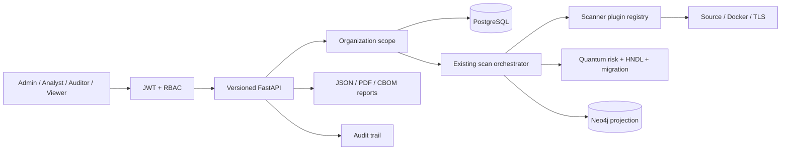
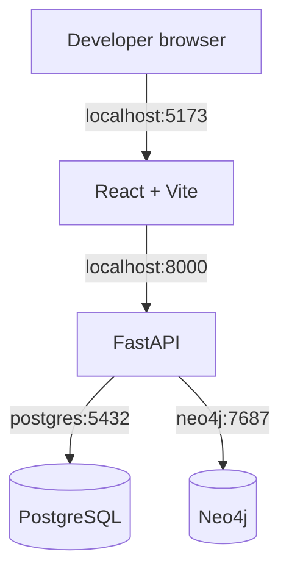
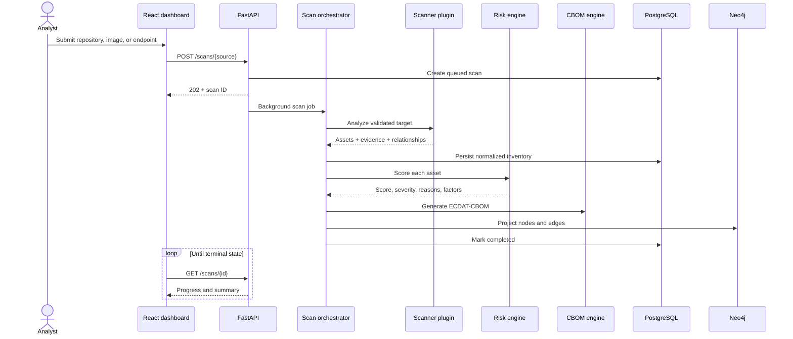
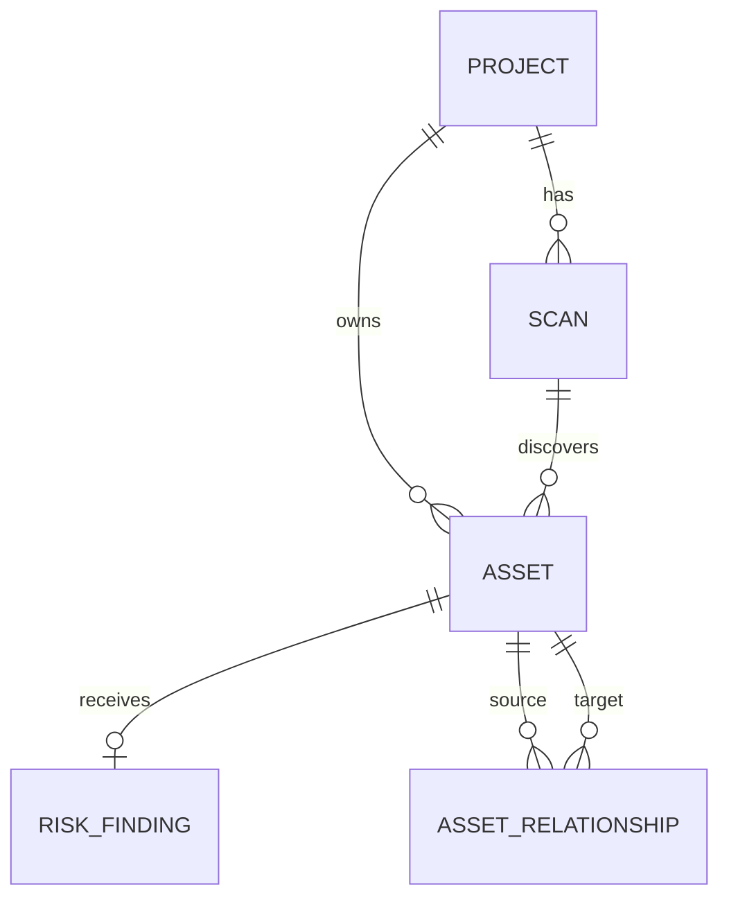

# ECDAT-X architecture

## Phase 3 enterprise boundary

Phase 3 wraps the Phase 1–2 discovery and intelligence pipeline in identity, tenant, audit,
report, and deployment boundaries. PostgreSQL remains authoritative and Neo4j rebuildable.



Access-token validation is stateless; refresh-token digests and revocation are relational. Tenant
IDs are denormalized onto high-volume domain tables for explicit, indexable isolation. A shared
limiter and asynchronous job queue are the first scale upgrades for multi-instance deployments.

## Design goals

Phase 1 establishes a reliable intelligence layer between raw scanner evidence and future PQC migration decisions. The architecture prioritizes evidence retention, deterministic analysis, scanner extensibility, and graceful degradation.

## Local deployment topology

The primary Phase 1 runtime is a four-service Docker Compose development stack:



Compose uses development targets with source mounts and reload support. The same Dockerfiles retain production targets so a future hosted deployment can override environment variables without changing application boundaries.

## Component boundaries

| Component | Responsibility | Does not own |
|---|---|---|
| React dashboard | Analyst workflows and visualization | Scanning or risk policy |
| FastAPI API | Validation, job intake, query contracts | Scanner-specific detection |
| Scan orchestrator | Lifecycle, normalization, persistence, engine coordination | Detection rules |
| Scanner registry | Plugin discovery by source type | Persistence |
| CBOM engine | Portable cryptographic inventory document | Database writes |
| Risk engine | Transparent Phase 1 scoring | Graph storage or UI presentation |
| PostgreSQL | Authoritative operational data | Topology traversal optimization |
| Neo4j | Rebuildable relationship projection | Source-of-truth inventory |

## Scan sequence



## Scanner plugin contract

Every plugin implements `ScannerPlugin`, declares a `ScanSource`, and returns a `ScanResult` containing normalized `DiscoveredAsset` and `DiscoveredRelationship` values. The orchestrator never branches on scanner implementation details beyond target preparation for repository archives.

This makes a future scanner additive:

1. Implement `ScannerPlugin.scan`.
2. Validate its target without a shell.
3. Return evidence-bearing domain objects.
4. Register it in `build_default_registry`.
5. Add an intake schema and API endpoint.

## Data model



- `Project` provides business criticality context.
- `Scan` tracks target, source, state, progress, summary, and generated CBOM.
- `Asset` retains normalized identity, location, evidence, confidence, and source details.
- `RiskFinding` retains score, severity, human reasons, and machine-readable factor contributions.
- `AssetRelationship` stores `USES`, `CONTAINS`, `DEPENDS_ON`, and `PROTECTS` edges for resilience when Neo4j is unavailable.

## Risk model

Phase 1 applies:

```text
risk score = algorithm security + dependency impact + asset criticality + asset-specific rules
```

Scores are clamped to 100. Each contribution includes a stable rule ID, points, and explanation. Severity thresholds are Critical ≥ 75, High ≥ 50, Medium ≥ 25, and Low below 25. The risk model is deterministic and intentionally not predictive.

Future centrality or HNDL inputs can become additional factor providers without changing API response contracts.

## CBOM design

ECDAT-CBOM uses CycloneDX-inspired concepts: a serial number, metadata component, component `bom-ref` identifiers, crypto properties, dependency records, and ECDAT namespaced properties for evidence and risk. Phase 1 uses `bomFormat: ECDAT-CBOM` and `specVersion: 1.0`; a formal CycloneDX export adapter can be added alongside it.

## Failure behavior

- Invalid or unsafe inputs mark a scan failed with an analyst-safe error.
- PostgreSQL transaction failures prevent a completed status.
- Neo4j failure adds a warning but does not discard the authoritative inventory; graph reads fall back to PostgreSQL.
- Docker unavailability fails only Docker jobs.
- Certificate validation failures are evidence, not a collection blocker; the scanner reconnects without verification and records the error.

## Scaling path

The current background execution is appropriate for Phase 1 and a single API worker. Production scale should move scan jobs behind a durable queue, object storage, and dedicated restricted scanner workers. The `Scan` state machine and normalized engine boundaries are already compatible with that transition.
