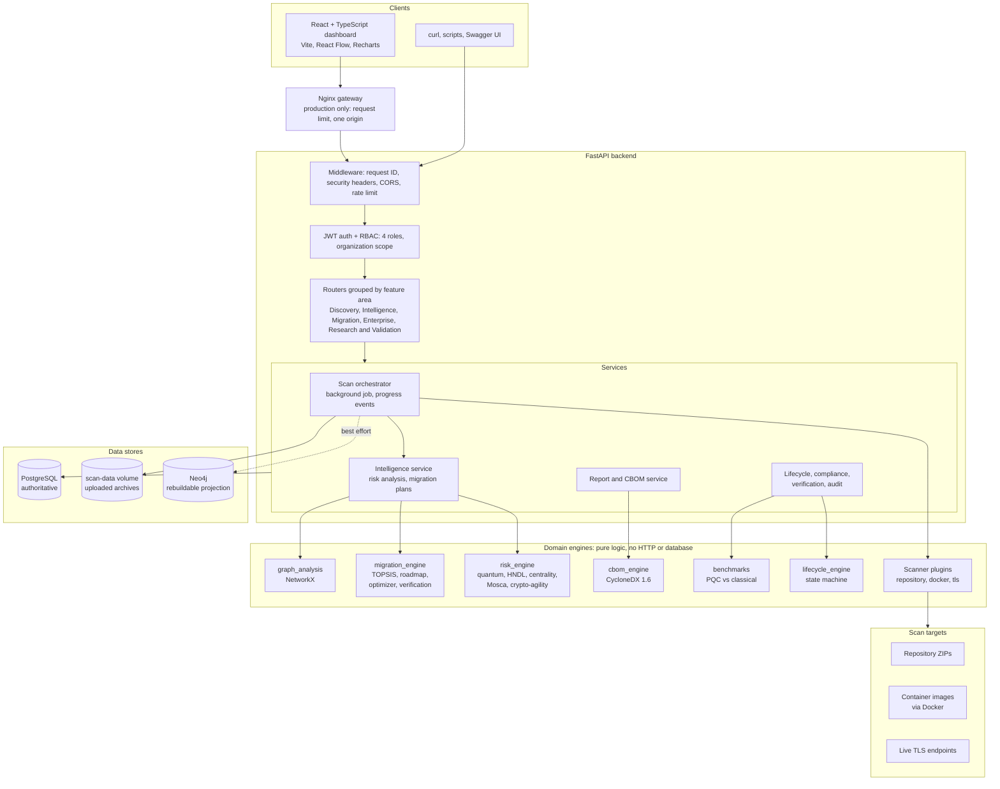
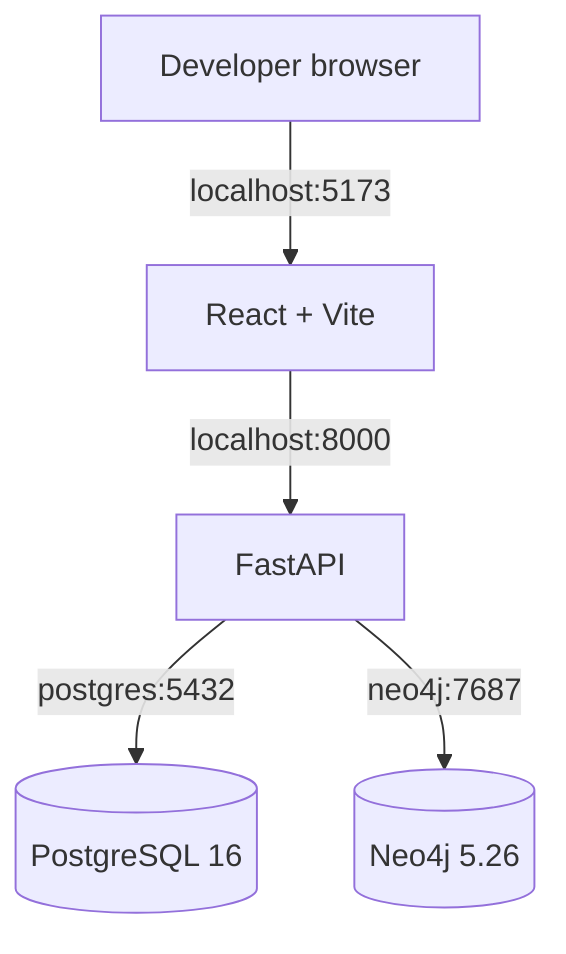
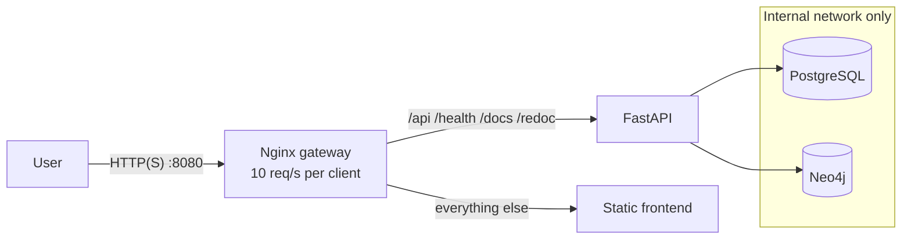
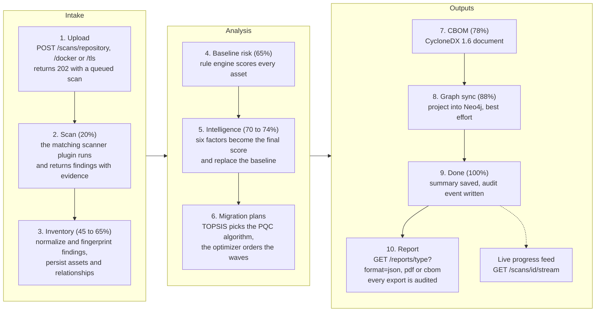
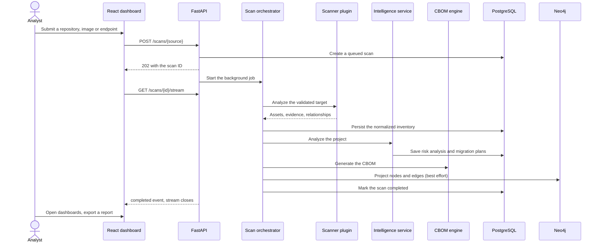
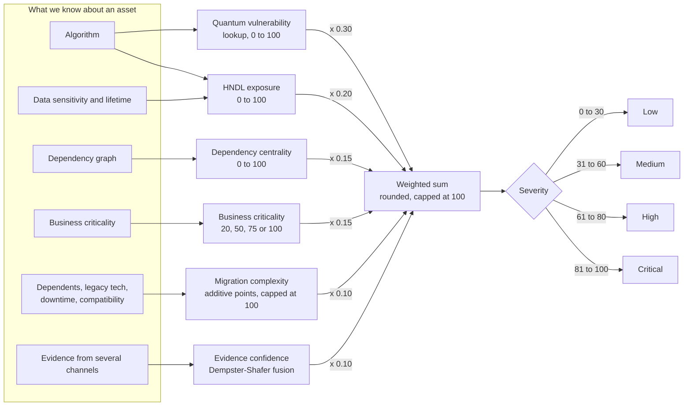
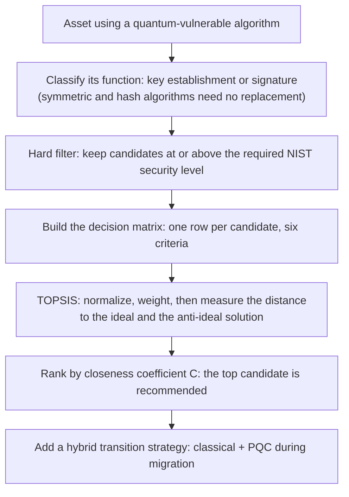
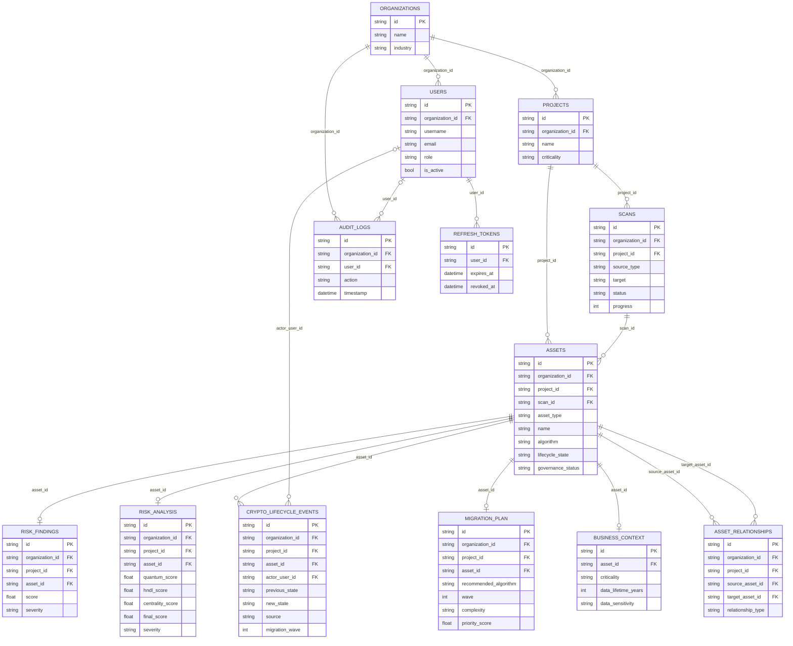

# ECDAT-X architecture

This page explains how ECDAT-X is built and why. Each diagram is drawn from the code as it is
today. Two of them (the database schema and the TOPSIS worked example) are **generated** from the
models and the solver, and a test fails if they go stale.

- [1. System architecture](#1-system-architecture)
- [2. Deployment topology](#2-deployment-topology)
- [3. Data flow: upload to report](#3-data-flow-upload-to-report)
- [4. Risk scoring methodology](#4-risk-scoring-methodology)
- [5. Migration decisions: TOPSIS](#5-migration-decisions-topsis)
- [6. Database schema](#6-database-schema)
- [7. Component boundaries](#7-component-boundaries)
- [8. Scanner plugin contract](#8-scanner-plugin-contract)
- [9. CBOM design](#9-cbom-design)
- [10. Failure behavior and scaling](#10-failure-behavior-and-scaling)

## Design goals

ECDAT-X sits between raw scanner evidence and PQC migration decisions. It prioritizes evidence
retention, deterministic and explainable analysis, scanner extensibility, tenant isolation, and
graceful degradation when an optional service (Neo4j) is down.

## 1. System architecture

Requests enter through the FastAPI middleware, are authenticated and tenant-scoped, and reach
thin routers. Routers delegate to services, which call the domain engines. The engines contain the
actual cryptographic and decision logic and know nothing about HTTP or the database.

PostgreSQL is authoritative for projects, scans, assets, relationships, risk and migration data.
Neo4j is a rebuildable projection; if it is unavailable the graph API keeps working from
PostgreSQL. In local development the browser talks to the API directly (allowed by an exact-origin
CORS list); in production the Nginx gateway puts both behind one origin.

## 2. Deployment topology

The development stack is a Docker Compose file with PostgreSQL, Neo4j, the API and the Vite
frontend, with source mounted for live reload:

The production profile (`deployment/docker-compose.prod.yml`) adds an Nginx gateway, publishes a
single port, and puts the databases on an internal-only network so only the API can reach them:

## 3. Data flow: upload to report

Everything a user sees is produced by one background job per scan. The job reports progress at
each stage, which the API exposes both by polling (`GET /scans/{scan_id}`) and as a live
Server-Sent Events feed (`GET /scans/{scan_id}/stream`).

The same flow as a sequence, including who talks to whom:

## 4. Risk scoring methodology

Scoring happens in two stages. A **rule-based baseline** scores each asset as soon as it is
persisted (severity: critical at 75 and above, high at 50, medium at 25). The **intelligence
stage** then computes the six-factor score below and *replaces* the baseline finding with it, so
the numbers analysts see everywhere are the six-factor ones.

| Factor | Weight | How it is computed |
|---|---:|---|
| Quantum vulnerability | 30% | Lookup in `risk_engine/algorithm_risks.json`. RSA, ECC, ECDH and Diffie-Hellman score 100 (Shor's algorithm breaks them). MD5 70, AES-128 50, AES-256 20, SHA-256 15, ML-KEM 0, and unknown algorithms 25. |
| HNDL exposure | 20% | `0.4 x sensitivity + 0.3 x min((data lifetime + exposure years) x 5, 100) + 0.3 x (100 if quantum-vulnerable)`. Sensitivity: public 0, internal 30, confidential 70, regulated, financial and restricted 100. |
| Dependency centrality | 15% | `0.3 x degree + 0.5 x dependents / max dependents + 0.2 x share of critical dependents`, scaled to 100. Uses the same relationships as the graph. |
| Business criticality | 15% | low 20, medium 50, high 75, critical 100. |
| Migration complexity | 10% | Points: 10 to 30 for dependent applications, 15 for legacy technology, 10 to 15 for a critical service, 20 for zero downtime, 20 for limited PQC compatibility. Capped at 100. |
| Evidence confidence | 10% | Dempster-Shafer combination of independent evidence channels (source, Docker, TLS, certificate, library). When channels conflict above 0.7 it falls back to a simple average. |

Every result carries the per-factor contributions and plain-language reasons, so a score can
always be explained. The **Mosca inequality** (`X + Y > Z`: years the data must stay secret plus
years to migrate, against years until a quantum computer arrives) is a separate lens on the same
assets. It answers "must we start now?" rather than "how risky is this?" and is explorable at
`/quantum-risk`.

## 5. Migration decisions: TOPSIS

For each quantum-vulnerable asset the recommender decides *which* PQC algorithm to use in four steps:

TOPSIS ranks each candidate by how close it is to the best possible outcome on every criterion
at once and how far it is from the worst. Four criteria are *benefits* (higher is better) and
two are *costs* (lower is better: public key size and ciphertext size), with the weights shown
below.

One consequence is worth knowing: **security level is a hard floor, not a weighted criterion.**
With the default floor (NIST level 1) the smallest and fastest parameter set wins, which is why
`ML-KEM-512` is chosen by default. Raising `required_security_level` changes the answer, as the
last table shows. The tables below are generated by running the real solver over the real
knowledge base for a key-establishment asset (for example RSA or ECDH):

<!-- topsis-example:start -->
**Step 1: the decision matrix** (raw values from the knowledge base)

| Candidate | performance rank | public key (B) | ciphertext (B) | maturity | compatibility | ease of migration |
| --- | ---: | ---: | ---: | ---: | ---: | ---: |
| ML-KEM-512 | 3 | 800 | 768 | 1.0 | 0.85 | 0.8 |
| ML-KEM-768 | 2 | 1184 | 1088 | 1.0 | 0.9 | 0.7 |
| ML-KEM-1024 | 1 | 1568 | 1568 | 1.0 | 0.8 | 0.6 |

Weights: performance rank 0.20 (benefit), public key (B) 0.15 (cost), ciphertext (B) 0.15 (cost), maturity 0.15 (benefit), compatibility 0.20 (benefit), ease of migration 0.15 (benefit)

**Step 2: normalize and weight, then find the ideal and anti-ideal solutions**

| Candidate | performance rank | public key (B) | ciphertext (B) | maturity | compatibility | ease of migration |
| --- | ---: | ---: | ---: | ---: | ---: | ---: |
| ML-KEM-512 | 0.1604 | 0.0566 | 0.0560 | 0.0866 | 0.1153 | 0.0983 |
| ML-KEM-768 | 0.1069 | 0.0837 | 0.0793 | 0.0866 | 0.1221 | 0.0860 |
| ML-KEM-1024 | 0.0535 | 0.1109 | 0.1143 | 0.0866 | 0.1086 | 0.0737 |
| **Ideal (best)** | 0.1604 | 0.0566 | 0.0560 | 0.0866 | 0.1221 | 0.0983 |
| **Anti-ideal (worst)** | 0.0535 | 0.1109 | 0.1143 | 0.0866 | 0.1086 | 0.0737 |

**Step 3: distance to each, and the closeness coefficient** `C = D− / (D+ + D−)`

| Rank | Candidate | D+ (to ideal) | D− (to anti-ideal) | Closeness C |
| --- | --- | ---: | ---: | ---: |
| 1 | ML-KEM-512 | 0.0068 | 0.1358 | 0.9524 |
| 2 | ML-KEM-768 | 0.0655 | 0.0718 | 0.5229 |
| 3 | ML-KEM-1024 | 0.1363 | 0.0000 | 0.0000 |

**The same decision with a stricter security floor** (`required_security_level = 3`)

| Rank | Candidate | Closeness C |
| --- | --- | ---: |
| 1 | ML-KEM-768 | 1.0000 |
| 2 | ML-KEM-1024 | 0.0000 |
<!-- topsis-example:end -->

Signature candidates (ML-DSA and SLH-DSA) are ranked the same way against their own criteria.
Recommendations can be verified afterwards against benchmark data and policy limits; see
`GET /analytics/validation/migrations` in the [API guide](api-guide.md).

## 6. Database schema

The inventory and analysis tables, generated from the SQLAlchemy models. Every domain table also
carries `organization_id` (and most `project_id`) copied onto it for tenant isolation and fast
filtering. Those repeated edges are omitted from the diagram; the columns are still listed on
each table, marked `FK`. A `||--o|` edge means at most one child row (for example one risk
analysis per asset).

<!-- er-diagram:start -->

<!-- er-diagram:end -->

- `organizations` own everything; `users` belong to one organization and hold a role.
- `refresh_tokens` store only a digest of each token, with revocation, so tokens can rotate.
- `projects` give business context. A `scans` row tracks target, state, progress, summary and the
  generated CBOM. `assets` retain identity, location, evidence, confidence and lifecycle state.
- `asset_relationships` store the `USES`, `CONTAINS`, `DEPENDS_ON` and `PROTECTS` edges, so the
  graph survives without Neo4j.
- `risk_findings` is what analysts see (score, severity, reasons, factors). `risk_analysis`
  keeps the six factor scores behind it.
- `migration_plan` holds the recommended algorithm, wave and reasoning per asset;
  `crypto_lifecycle_events` is the append-only history of every state change.
- `audit_logs` records who did what, per organization.

## 7. Component boundaries

| Component | Responsibility | Does not own |
|---|---|---|
| React dashboard | Analyst workflows and visualization | Scanning or risk policy |
| FastAPI routers | Validation, authorization, query contracts | Domain logic |
| Services | Orchestration and persistence | Detection rules, scoring formulas |
| Scan orchestrator | Scan lifecycle, normalization, engine coordination | Detection rules |
| Scanner registry | Plugin lookup by source type | Persistence |
| Risk engine | Transparent, explainable scoring | Graph storage or presentation |
| Migration engine | Algorithm selection, ordering, verification | Persistence |
| CBOM engine | Portable cryptographic inventory document | Database writes |
| Lifecycle engine | Asset state machine and its rules | Persistence |
| PostgreSQL | Authoritative operational data | Topology traversal optimization |
| Neo4j | Rebuildable relationship projection | Source-of-truth inventory |

## 8. Scanner plugin contract

Every plugin implements `ScannerPlugin`, declares a `ScanSource`, and returns a `ScanResult` of
normalized `DiscoveredAsset` and `DiscoveredRelationship` values. The orchestrator never branches
on scanner internals, so a new scanner is additive. The step-by-step guide, with a complete
worked example, is in [Scanner development](scanner-development.md).

## 9. CBOM design

The CBOM is a **CycloneDX 1.6** document (`bomFormat: CycloneDX`) that validates against the
official schema, so any CycloneDX tool can read it. Each cryptographic asset becomes a component
with a `bom-ref`, spec-defined algorithm primitives and crypto properties, dependency records, and
ECDAT-namespaced properties for evidence and risk score. A one-page and a multi-page PDF
rendition are produced from the same inventory.

## 10. Failure behavior and scaling

- Invalid or unsafe input marks a scan failed with an analyst-safe error message.
- A database failure prevents a `completed` status; a scan is never half-recorded as done.
- Neo4j failure adds a warning but never discards the inventory; graph reads fall back to PostgreSQL.
- Docker being unavailable fails only Docker scans.
- Certificate validation failures are recorded as evidence, not treated as a reason to stop
  collecting; the TLS scanner reconnects without verification and notes the error.
- **Scaling path:** background execution suits one API worker today. For multiple instances, move
  scan jobs behind a durable queue, put uploads in object storage, run scanners in restricted
  workers, and replace the per-process rate limiter and progress feed with a shared one. The scan
  state machine and engine boundaries already allow that without changing the API.
