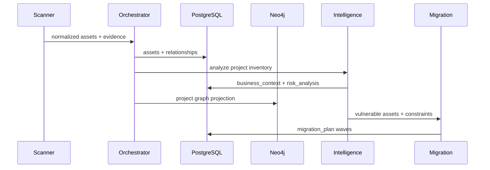

# Phase 2 cryptographic intelligence architecture

## Design boundary

Phase 2 begins after Phase 1.5 has normalized scanner output. Repository, Docker, and TLS plugins
are unchanged. `IntelligenceService` consumes persisted assets and relationships, applies business
context, runs deterministic intelligence engines, promotes the final score into the compatible
`RiskFinding` record, and stores the richer analysis separately.



## Intelligence modules

| Module | Input | Output |
|---|---|---|
| Evidence intelligence | Independent source, Docker, TLS, certificate, and library channels | 0–99 confidence and channel list |
| Quantum risk | Configurable algorithm profile | Classification, 0–100 score, reason |
| HNDL analysis | Sensitivity, lifetime, exposure period, quantum vulnerability | HNDL severity, score, reason |
| Dependency centrality | Neo4j-compatible asset relationships | Degree, affected systems, critical-path impact |
| Business criticality | Assigned business context | 0–100 business impact |
| Migration complexity | Dependencies, legacy status, downtime, compatibility | Complexity label, score, constraints |
| Final risk | Six normalized factors | 0–100 score, severity, weighted factors |
| PQC recommendation | Algorithm, use case, performance and memory constraints | ML-KEM/ML-DSA or hybrid target |
| Roadmap | Dependency graph and recommendations | Ordered migration waves |

## Final risk formula

```text
Final = 0.30 × Quantum Vulnerability
      + 0.20 × HNDL Exposure
      + 0.15 × Dependency Centrality
      + 0.15 × Business Criticality
      + 0.10 × Migration Complexity
      + 0.10 × Evidence Confidence
```

Severity boundaries are inclusive: Low 0–30, Medium 31–60, High 61–80, and Critical 81–100.
The algorithm knowledge base is JSON so research updates do not require changing the scoring code.

## Persistence

- `business_context`: owner, criticality, sensitivity, lifetime, downtime, compatibility, legacy flag
- `risk_analysis`: quantum, HNDL, centrality, business, complexity, evidence, final score, explanations
- `migration_plan`: recommended algorithm, wave, complexity, reasons, full recommendation metadata

PostgreSQL remains authoritative. Neo4j remains a rebuildable dependency projection. Live blast
radius queries prefer Neo4j and fall back to the dependent IDs persisted with each analysis.

## PQC recommendation policy

RSA migrations cover both key establishment and signatures through ML-KEM plus ML-DSA, with a
hybrid period. ECDH and classical Diffie-Hellman map to ML-KEM. ECC signatures map to ML-DSA.
Legacy TLS maps to TLS 1.3 hybrid key exchange. Constrained IoT key establishment selects
ML-KEM-512; balanced enterprise workloads default to ML-KEM-768. Recommendations expose latency,
key-size, compatibility, and resource implications rather than presenting a context-free mapping.

## Migration ordering

Roadmap generation treats graph edges as consumer-to-dependency links. `PROTECTS` edges are
normalized so certificates precede protected applications. Wave numbers are the longest dependency
distance: cryptographic primitives and trust anchors first, shared libraries and security services
next, and consuming applications last. Cycles are handled conservatively as a shared first-wave
unit instead of blocking roadmap generation.

## SecureBank demonstration

The seed models a customer database with 20-year financial-data retention, a critical payment
service, and one RSA-2048 certificate shared by 43 systems. The deterministic result is a Critical
score of 94, 95%+ corroborated evidence confidence, critical HNDL exposure, and three migration
waves. This scenario is synthetic and contains no private keys or production data.
